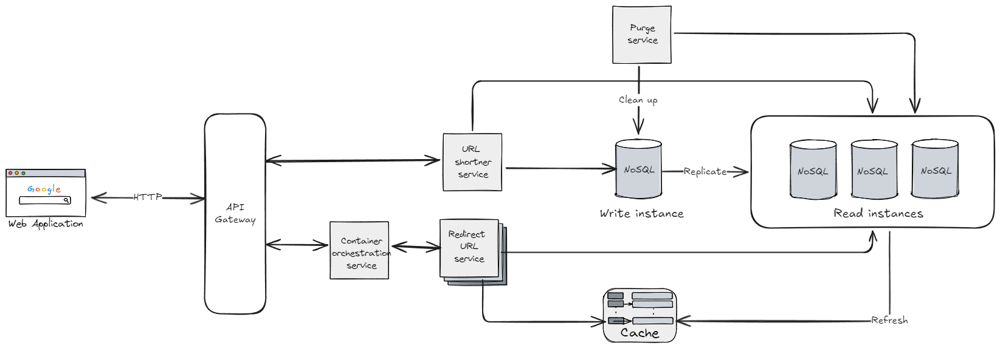

# URL shortener
## Requirements
### Functional
- [x] 100 million URLs are generated per day.
- [x] As short as possible.
- [x] Shortened URL can be a combination of numbers (0-9) and characters (a-z, A Z).
### Non-functional
- [x] High availability.
- [x] High scalability.
- [x] Fault tolerance.
## Architecture


### API design
**Given a long URL, create the short URL version.**
```http
POST /api/v1/{longURL}/shorten
```
**Responses**:
```http
HTTP/2.0 201 Created
{
    "shortURL": "https://url.shortner/a735b8q"
}
```
**Given a short URL, return the long URL.**
```http
GET /api/v1/{shortUrl}
```
**Responses**:
```http
HTTP/2.0 302 Found
Location: https://guto.dev/long-url-example-a434112b
```

```http
HTTP/2.0 404 Not Found
```
### Microservices
Since the redirect flow is more critical and needs a have a better performance, we can break the system into two microservices, URL shortener and redirect URL services respectively. Now the services can scale independently, and we can have more instances of the redirect services to handle the traffic.
### Container orchestration
To handle the traffic spikes automatically, we can add a container orchestration that upscale the number of pods dynamically. This component also handles service discovery, container failures and load balancing.
### API Gateway
Since we have two services, how can the user will be able to call them? To solve this problem, we can use a API Gateway. The user send a request to this component and the gateway move the request forward to one of the servers. It also can handle rate limiting, logging and monitoring.
### Storage
For store the data we can use a Key-value storage, in order to store a hash table were the key is the short URL and the value the long one. We can add data replication to ensure high availability. For the redirect URL service, we can add a cache layer to reduce the latency of the requests.
### URL Shortening
For shortening the URL we can use a hash function, but this approach might cause some collisions. To handle collisions we can check if the key already exists for a different value, if its true, we can concatenate the long URL with some predefined string, generate a new hash and try again, until there are no more conflicts. This approach is simple, but can increase the latency of the system. To improve this method, a bloom filter can be used.

Another approach is to generate a new ID for the URL, and them convert the ID to a base 62. The long URL can be retrieved by parsing the short URL to base 10, to get the ID and them searching for the original URL related to this ID.
### Purge service
To improve the storage efficiency we can add a purge service and set a expiration date for the URL's. A long with the URL information, we could add a createadAt to filter the expired data and them clean it from time to time.