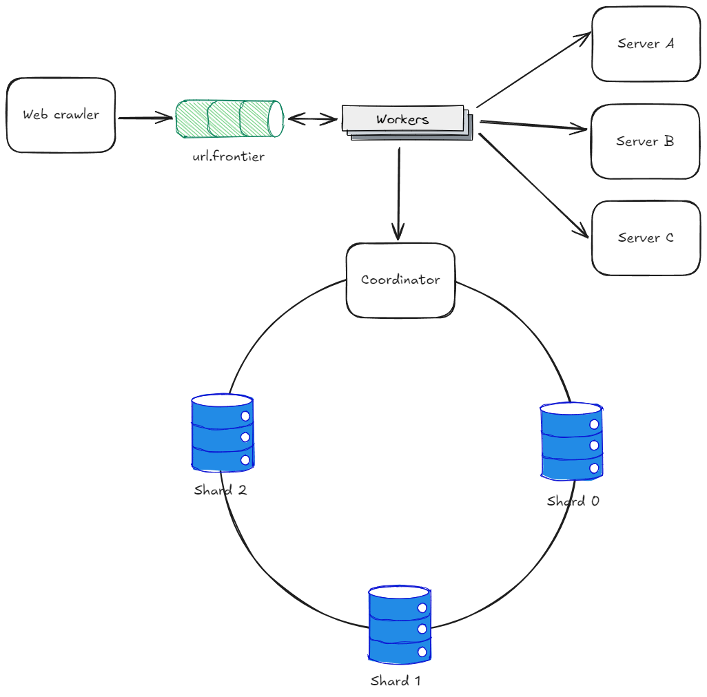

# Web crawler
## Context
A **web crawler**, also known as a **spider** or **bot**, is a program or automated script that systematically browses the internet to **index and collect data** from websites.
### Common Uses
* **Search engines (e.g., Googlebot):** To keep search indexes up to date.
* **Data mining / web scraping:** To extract specific data, such as prices or news articles.
* **Web monitoring:** Monitor **SEO metrics** (e.g., broken links, slow-loading pages)
* **Web archiving:** It's how you can view what a website looked like in the past (e.g., CNN’s homepage in 2005).
## Requirements
### Functional
- [x] Should download all the web pages addressed by the URL list
- [x] Should extract URLs from these pages
- [x] Should add to the list of URLs to be downloaded
- [ ] Should consider newly added or edited web pages
- [ ] Duplicated content should be ignored
### Non functional
- [x] Should be able to handle 1 billion pages per month
- [x] Need to store HTML pages up to 5 years
- [ ] High scalable
- [ ] Robustness
- [ ] Politeness
- [ ] Extensibility
## Architecture

### Back of the envelope

### Implementation

